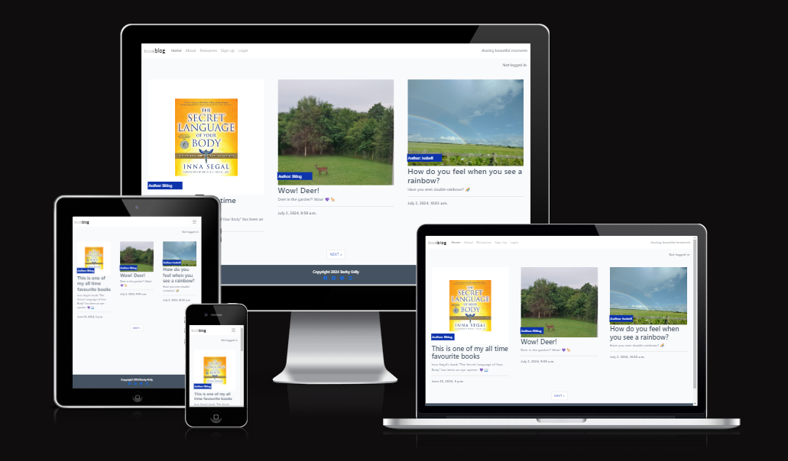

# Project4 - BookBlog

This project is created as part of Code Institute's Software Development course.
[BookBlog's](https://bkblog-fdb72a8c4df9.herokuapp.com/) layout and code is heavily based on Code Institute's Walk-through project
["I Think Therefore I Blog"](https://github.com/Code-Institute-Solutions/blog/tree/main). BookBlog has no commercial intention.
Aim of this project was to create a blog where Site Users can share book reviews, or create articles for the bookblog, comment on the reviews/books/blog posts. All of the articles, reviews, comments and suggestions need to be approved by BookBlog's Admin.
Bookblogs theme: books and experiences related to energy work, ascension, natural methods to work on wellbeing, heureka moments, serendipity, beautiful changes in life and similar.
At the time of submission deadline, on developer's screen there seems to be only an option to add posts via Django page. 

Deployed site: [BookBlog](https://bkblog-fdb72a8c4df9.herokuapp.com/)

Github: [link to github](https://github.com/BarbyKelly/blog)

# Content
- [UX Design](#ux-design)
- [User Stories](#user-stories)
- [Features](#features)
- [Structure](#structure)
- [Testing & Validation](#testing--validation)
- [Deployment](#deployment)
- [References & Credits](#references--credits)
- [Acknowledgements](#acknowledgements)

# UX Design

## User Stories

### Admin can:

- Create BookBlog content
- Manage BookBlog content
- Add, edit and delete their own comments
- Approve comments
- Edit and Delete any comments by any Site User
- Add resources
- Edit and delete resources
- Mark Collaboration Requests as "read"

#### Future Features for Admin:

- Comments by Site Users can only be edited by Site Users, and deleted by Admin if needed

### Site User can:

- View a paginated list of posts, and choose which one to read
- Sign up for an account
- Login
- Add comments
- Modify or delete their own comments
- Create drafts

#### Future Features for Site Users:

- Sign up for Newsletter
- Create posts together with other Site Users
- Comments limited to max 500 characters
- System blocking unsuitable/rude/inappropriate words
- Create blog content

### Visitor may:

- View a paginated list of posts, and choose which one to read
- Click on Home, About, Resources, Register, Login
- Opt to Sign up for an account
- Fill on Collaborator Form

#### Future Features for Visitors:

- Sign up for Newsletter

[Back to the overview](#content)

### Deployments

- Ensure env.py is set up properly
- Check gitignore
- Set DEBUG=False in settings.py
- Login to Heroku
- Click on settings in the Menu
- Click on Reveal Config Vars
- Check if these look ok
- Click on Deploy in the main menu
- Scroll down to the end and click on Deploy Branch
- Once Heroku has finished deploying your app, "View app" appears at the bottom of the page
- Click on "View app"

[Back to the overview](#content)

## Wireframes

- Wireframes created with [Balsamiq](https://balsamiq.com/wireframes/)

### Homepage

### Comment as a Logged in User

### About page

### Resources page

### Signup page

### Login page

[Back to the overview](#content)

## Colors

- Color contrast for large text checked on [Coolors website](https://coolors.co/contrast-checker/6f90f4-ffffff)
- Color contrast check for brand, checked on [Coolors](https://coolors.co/contrast-checker/35353b-ffffff)

# Features

## Common Features
- **Navigation Menu**
    - Home
    - About
    - Resources
    - Sign up
    - Login

- **Footer**
    - Copyright
    - Social Media links

## Homepage Features
- Three different articles are displayed, with author's name, suitable image, excerpt, and date and time of the article
- Page visitor can see if they are logged in or not, top right corner
- Below the articles, there's a button 'next', which brings site visitor to the next page of articles

## Future Features

- Site Users can add posts once they log in
- Admin can add posts not just only via Django
- Add an option to like the comment or post with a heart favicon
- Resources page displayin "Suggestion" form, for visitors to be able to fill it
- Image/video of waves on top of Resources page
- Resources are displaying their default image/website, not just the link/text

[Back to the overview](#content)

# Testing & Validation

- 

  validated with Google developer tools

- 

  validated with: [W3C Markaup Validation](https://validator.w3.org/)

- 

  validated with: [W3C Markup Validation](https://validator.w3.org/)

- 

  validated with: [codebeautify](https://codebeautify.org/jsvalidate)

- ReadMe links were tested
- Tabs were tested

## Bugs

- Resources app displayed only one resource at a time. With tutor's guidance to add for loop, all of the resources were displayed.

### Images post_detail.html
- Images for bookblog articles showed up as expected on the Home page, matching the subject of the Title.

- When developer clicked on any post, the new page displayed the placeholder image instead of the unique image selected for each post.

- Developer had inspected the page before:

[Previous image](docs/readmeimages/previousinspection.png)

- This time the developer clicked on the image part of the page instead:

[New inspection](docs/readmeimages/newinspection.png)

- The developer finally saw the right area, where image details were
- The developer then compared codes of the images between home page and the new tab:

[Correct code](docs/readmeimages/correctimagecode.png)

[Placeholder code](docs/readmeimages/placeholder.png)

- By matching post_detail.html image code with the home page one, the correct images started to display in the new tab as well:

[Correct image displayed](docs/readmeimages/correctimagedisplayed.png)

### am I Responsive

- am I responsive test showed white screens instead of the website: [Blank am I responsive](docs/readmeimages/amiresponsiveblank.png)
  Thanks to Kera's post on Slack, developer found out that she needed to install [an extension](https://chromewebstore.google.com/detail/ignore-x-frame-headers/gleekbfjekiniecknbkamfmkohkpodhe?pli=1), so that Heroku site could be tested for responsiveness. Sorted! Am I responsive image displayed at the start of the ReadMe.

### Known Bugs

- Resources showing up in Django as Resourcess. The developer understand for future it is important to use singular versions
- Collaboration form to be made smaller to fit on the screen better
- When post is open for further reading, the image of the post is not displaying fully, on developer's screen size
- Resources is missing an image/video on top of the page
- Images/the original links are displayed only as text or link, instead of an image of the page where user will get to 
  after clicking on the link
- js validation showed one error, not fixed
- Spelling check was not done for the website, yet
- Sign up boxes could be shown in a nicer way, at the moment they are not looking even
- Alert messages, pop ups are showing up in the color of the walk-through, instead of developer's chosen color
- Admin and Site Users are not able to crete posts when logged in. Admin can create posts from Django
- Not all of the python files have been checked with [CI Python Linter](https://pep8ci.herokuapp.com/)
- There are errors showing in some of the python files, checked by developer:

- Error pages not added

### Forking the repository

- Go to [Github](https://github.com/)
- If you want to fork one of your own repos, then DO NOT login under your own name, as fork option is not available

- Search Github or Google for the repo that you would like to fork
- Open the repo you want to fork
- On the same line as the Repo's name, on the right, click on the arrow beside the Fork
- Click on: + Create a new fork

- Choose a name for the repo
- Add description if you desire
- Choose if you want to Copy the main branch only
- Click on: "Create fork"

- [Spoon-Knife Github repo](https://github.com/octocat/Spoon-Knife) was used to demonstrate how to fork

### Creating the repository

- Code Institute's [template](https://github.com/Code-Institute-Org/ci-full-template) was used to set up this project.
- After clicking on the above template link, click on the green button: "Use this template"
- From there choose: "Create a new repository"
- Fill in "Repository name" with your desired name for the project
- Leave the project Public like the default setting (for Code Institute projects)
- Click on the green button "Create repository"

[Back to the overview](#content)

# References & Credits

- BookBlog's code is based on following Code Institute's Walk-through project ["I Think Therefore I Blog"](https://github.com/Code-Institute-Solutions/blog/tree/main) . 
  The developer has credited Walk-through mainly on top of html files, 
  due to enourmous number of other files, which are all coded like Walk-through project.

- General ReadMe template derived from: [findMEreadME](https://github.com/brodsa/findMEreadME/blob/main/README.md#content)

- Developer got inspiration for her ReadMe User Stories layout from her Facilitator Laura's Project 4: [The Happy Reader](https://github.com/LauraMayock/The-happy-reader/blob/main/README.md)

- Responsiveness test/image created with: [am I responsive](https://ui.dev/amiresponsive)

- Wireframes created with [Balsamiq](https://balsamiq.com/wireframes/)

- Developer read this article to remember how to get links to open in a new tab. Article by Jessica Wilkins: [How to Open a Link in a New Tab](https://www.freecodecamp.org/news/how-to-open-a-link-in-a-new-tab/#:~:text=You%20can%20use%20the%20target,opening%20anchor%20tag%20like%20this.)
 
- How to add favicon: [W3 Schools](https://www.w3schools.com/html/html_favicon.asp)

## Images

- Inna Segal's book cover image from: [Paper Plus](https://www.paperplus.co.nz/shop/books/non-fiction/mind-body-spirit/general/the-secret-language-of-your-body)

- Double rainbow: taken by the developer

- Flowers drawing by developer's 10 year old daughter Aoife, made in school

- Penguin drawing by developer's 6 year old daughter Ciara, made in school

- Beach: taken by the developer, Fenit, Co. Kerry, Ireland

- Default image clouds taken by the developer, Co. Kerry, Ireland

- Images converted with [Simple Image Resizer](https://www.simpleimageresizer.com/resize-image-to-500-kb)

[Back to the overview](#content)

# Acknowledgements

- Developer is grateful for any guidance and support provided by her family and friends, mentor, facilitator, tutors, Slack members, and  
  online content creators.

- Due to circumstances and time constraint, the project is not fully finished as required:
  - missing ERD
  - personalised model, Suggest, is not displaying on the website (only available on Django)
  - Resources app is supposed to have a wave image/video on top of the page
  - all of the resources links should be displaying their own images/websites
  - not enough testing done
  - there are probably bugs that the developer has not found yet

[Back to the overview](#content)