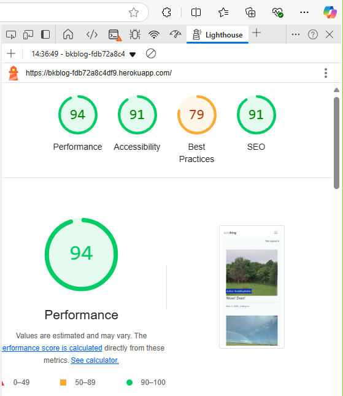
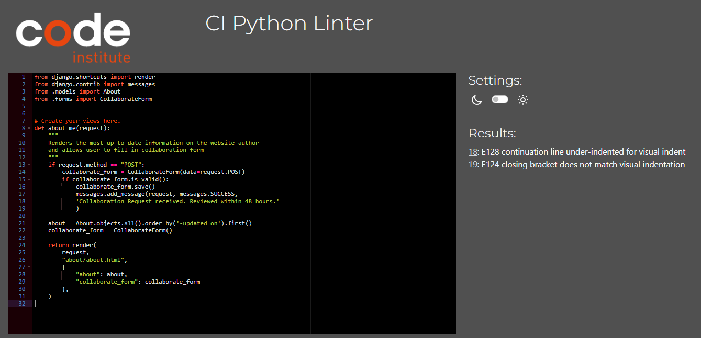

⚠️ Project Status Note

This is the 4th of 5 projects, completed and assessed as part of my Diploma in Full Stack Software Development course with Code Institute. At the time of submission, all required features and links were functional to the best of my knowledge.

Some external links or deployments may no longer work as originally intended due to platform or service changes. The source code and README are preserved, except for this 'Project Status Note'.

# Project4 - BookBlog

This project is created as part of Code Institute's Software Development course.
[BookBlog's](https://bkblog-fdb72a8c4df9.herokuapp.com/) layout and code is based on Code Institute's Walk-through project
["I Think Therefore I Blog"](https://github.com/Code-Institute-Solutions/blog/tree/main). BookBlog has no commercial intention.

Bookblog is for sharing beautiful moments and experiences, wonderful books through blog posts. 

For now only Admin can create blog posts, and users can read blog posts, comment on the blog posts, access resources, sign up and sign in, or fill in a Collaboration Form
on About page. All of the articles, reviews, comments and suggestions need to be approved by BookBlog's Admin, the Developer.
As this is a project, this website's forms are not monitored.

Deployed site: [BookBlog](https://bkblog-fdb72a8c4df9.herokuapp.com/)

Github: [link to github](https://github.com/BarbyKelly/blog)

# Content
- [UX Design](#ux-design)
- [User Stories](#user-stories)
- [Features](#features)
- [Testing & Validation](#testing--validation)
- [Deployment](#deployment)
- [References & Credits](#references--credits)
- [Acknowledgements](#acknowledgements)

# UX Design

## User Stories

### Admin can:

- Create BookBlog content
- Manage BookBlog content
- Add, edit and delete their own comments
- Approve comments
- Edit and Delete any comments by any Site User
- Add resources
- Edit and delete resources
- Mark Collaboration Requests as "read"

#### Future Features for Admin:

- Comments by Site Users can only be edited by Site Users, and deleted by Admin if needed, no editing option for Admin, except for their own comments

### Site User can:

- View a paginated list of posts, and choose which one to read
- Sign up for an account
- Sign in
- Add comments
- Modify or delete their own comments

#### Future Features for Site Users:

- Sign up for Newsletter
- Create posts together with other Site Users
- Comments limited to max 500 characters
- System blocking unsuitable/rude/inappropriate words
- Create blog content
- Comments visible only to Signed In users
- Sign Out form has an option to "Go Back" with a button, instead of just clicking on a different NavLink, if don't want to Sign Out
- Change their password
- Delete their account
- Recover their Username and/or password

### Visitor may:

- View a paginated list of posts, and choose which one to read
- Click on Home, About, Resources, Register, Sign In
- Opt to Sign up for an account
- Fill in Collaboration Form

#### Future Features for Visitors:

- Sign up for Newsletter

[Back to Content](#content)

### Deployments

- Ensure env.py is set up properly
- Check gitignore
- Set DEBUG=False in settings.py
- Login to Heroku
- Click on settings in the Menu
- Click on Reveal Config Vars
- Check if these look ok
- Click on Deploy in the main menu
- Scroll down to the end and click on Deploy Branch
- Once Heroku has finished deploying your app, "View app" appears at the bottom of the page
- Click on "View app"

[Back to Content](#content)

## Wireframes

- Wireframes created with [Balsamiq](https://balsamiq.com/wireframes/)

### Homepage

### Comment as a Logged in User

### About page

### Resources page

### Sign Up page

### Login page

Developer changed from original Login to Sign In. Due to time constraints, Wireframes were not updated after the change

[Back to Content](#content)

## Colors

- Color contrast for large text checked on [Coolors website](https://coolors.co/contrast-checker/6f90f4-ffffff)
- Color contrast check for brand, checked on [Coolors](https://coolors.co/contrast-checker/35353b-ffffff)

# Features

## Common Features
- **NavBar, NavLinks**
    - Logo
    - Home
    - About
    - Resources
    - Sign Up
    - Sign In
    - Sign Out - When already Signed In, and Sign Up and Sign In NavLinks are not visible

- **Footer**
    - Copyright
    - Social Media links

Disclaimer: Developer used Dev Tools, to demonstrate bookblog's pages on various screensizes

## Side Menu

- Displayed on smaller screen sizes instead of NavBar
- Logo remains top left
- Side Menu displayed top right
- NavLinks open below Logo
- NavText is not clickable, and is displayed below NavLinks
- 'Signed in as (username)' or 'Not signed in' is displayed below Side Menu when Side Menu closed, or below NavText on the left when Side Menu is Open

## Homepage Features
- bookblog logo on the top left
- NavBar with NavLinks on top of the page or in Side Menu for smaller screens
- NavText 'sharing beautiful moments' on top right, or at the bottom of the Side Menu for smaller screens
- In top right corner, below NavText, 'Not signed in' or 'Signed in as ...', is displayed
- Various blog posts displayed, with author's name, suitable image, excerpt, and date and time of the article
- Below blog posts, above footer, there's a button 'Next >>', which brings site visitor to the next page of blog posts,
  or 'Prev <<' is Visitor is not on the first page of blog posts, and clinking on Prev brings visitor back to previous page of blog posts.
- Visitor may click on the title of the article, which opens up the article in a new tab, leaving Home page open in a previous tab
- visitor may read the article, read comments, if there are any, and if signed in, reader can leave a comment
- If not signed in, Visitor can click on 'Sign In' on NavBar
- Footer shows Copyright details, and clickable links to Default Social Media pages

[Back to Content](#content)

## Comments Features

- Comments are visible to all users, Signed In or not
- Only Signed in Users can comment

- If User not signed in:

- "Here you can leave a comment:" is displayed for Signed in Users, and their comments are available for editing or deleting:

- User can edit or delete only their own comments (except Admin, who can edit and delete any comment)

- 'Body*' is mandatory if user wants to comment, 'Please fill in this field' pops up below 'Body*', if trying to submit without text:

- 'Comment was submitted. Awaiting for approval.' is displayed:

'This comment is awaiting for approval by an administrator', is displayed.
User may edit or delete their comment before it is approved,

[Back to Content](#content)

## About Features
- bookblog logo on the top left
- NavBar with NavLinks on top of the page or in Side Menu for smaller screens
- NavText 'sharing beautiful moments' on top right, or at the bottom of the Side Menu for smaller screens
- In top right corner, below NavText, 'Not signed in' or 'Signed in as ...', is displayed
- Default Image of the clouds is displayed on the right or on top of 'About' text, depending on the screen size.
- Text about bookblog is beside or below the default image
- Below 'About' text, date and time of the text update is displayed
- Collaboration Form is located below 'About' text
- Visitor has an option to fill in their name, Email, and Message, and then Submit Collaboration Form, if they wish to share their ideas for blog posts, 
  beautiful moments or books that shared something wonderful or made a difference for them
- All form fields are mandatory and marked with asterisks to highlight they are mandatory
- Footer shows Copyright details, and clickable links to Default Social Media pages

[Back to Content](#content)

## Resources Features
- bookblog logo on the top left
- NavBar with NavLinks on top of the page or in Side Menu for smaller screens
- NavText 'sharing beautiful moments' on top right, or at the bottom of the Side Menu for smaller screens
- In top right corner, below NavText, 'Not signed in' or 'Signed in as (username)', is displayed
- Various links are available for Visitor to click on
- Visitor can click on links to open YouTube videos
- Videos may open with an ad, if Visitor has no YouTube subscription. This is out of Developer's expertise
- Only Admin can add and edit Resources
- Statement on the right, below video links, states Links added by Site's admin 
- Footer shows Copyright details, and clickable links to Default Social Media pages

[Back to Content](#content)

## Sign Up Features
- bookblog logo on the top left
- NavBar with NavLinks on top of the page or in Side Menu for smaller screens
- NavText 'sharing beautiful moments' on top right, or at the bottom of the Side Menu for smaller screens
- In top right corner, below NavText, 'Not signed in' is displayed
- Visitor may fill in 'Sign Up' form
- Visitor may click on 'Sign In' instead, if they already have an account
- Once Visitor has Signed up, 'Sign Out' replaces 'Sign Up' and 'Sign In' NavLinks, and top right corner now displays 'Signed in as ...',
and visitor is brought to Home page
- Footer shows Copyright details, and clickable links to Default Social Media pages

[Back to Content](#content)

## Sign In Features
- bookblog logo on the top left
- NavBar with NavLinks on top of the page or in Side Menu for smaller screens
- NavText 'sharing beautiful moments' on top right, or at the bottom of the Side Menu for smaller screens
- In top right corner, below NavText, 'Not signed in' is displayed
- User may fill in Username and Password to 'Sign In'
- Visitor has an option to click on 'Sign Up' first, if they don't have bookblog account yet
- User may check 'Remember Me:' checkbox
- User may click on 'Sign In' button

- Once User is Signed in, NavLink 'Sign Out' replaces 'Sign Up' and 'Sign In' NavLinks'
- Below NavBar message is displayed: 'Successfully signed in as (username)
- Top right corner, below NavText then displays: 'Signed in as (username)',

- Once signed in, User may comment on blog posts
- Footer shows Copyright details, and clickable links to Default Social Media pages

[Back to Content](#content)

## Sign Out Features

- bookblog logo on the top left
- NavBar with NavLinks on top of the page or in Side Menu for smaller screens
- NavText 'sharing beautiful moments' on top right, or at the bottom of the Side Menu for smaller screens
- In top right corner, below NavText, 'Signed in as (username)' is displayed
- User may click on 'Sign Out' button to Sign Out

- User is then signed out, Home page opens, and below NavBar message confirms: 'You have signed out.'
- NavBar links then show 'Sign Up' and 'Sign In' options instead of 'Sign Out'
- On the right, below NavText, 'Not signed in' is displayed
- Footer shows Copyright details, and clickable links to Default Social Media pages

[Back to Content](#content)

## Future Features

- Site Users can add posts once they log in
- Admin can add posts directly, not just only via Django
- All images on Home page have white box around them, to match the blog post with the book cover. At the moment book cover image looks different than images/photos used for other blog posts
- Add an option to like the comment or post with a heart favicon
- Clickable 'Sign In'/'Sign Up' options near comments where at the moment text says 'Sign in to leave a comment', and presently visitor needs to find the 'Sign In' option on   the page by themselves 
- Resources page displaying "Suggestion" form, for visitors to be able to fill it
- Image/video of waves on top of Resources page
- Resources are displaying their default image/website, not just the link/text
- Admin would notify User, if their Comment has been deleted due to inappropriate details, wording or images
- Admin won't have an option to edit other User's post
- Admin can notify User if there's spelling error, inappropriate details, in their comment, before deleting it
- Resources to be replaced with links that open without ads
- Resources not displayed if 'Draft' or 'Unapproved' or 'Not yet approved'
- Sign In form has asterisks for required fields: Username and Password 
- Sign Up form has asterisks for required fields: Username, Password, Password(again)
- When Sign Up is successful, and Home page opens, pop up on the screen to say "Successfully signed up, and signed in as ...",
  instead of "Successfully signed in as..."
- Copyright year is updated automatically
- Social Media links bring Visitor to bookblog's Social Media pages, instead of default home pages of each Social Media
- Sign Out form asks 'Are you sure you want to sign out?', instead of just Signing User out after first click on 'Sign Out' button, may even suggest new blogposts or comments that user has not seen yet
- Color difference on blogposts and comments that User has already viewed, or commented on
- NavBar and footer sticky, visible at all times, for easier access

[Back to Content](#content)

# Testing and Validation

- [Lighthouse Reports](#lighthouse-reports)
  - [Google Dev Tools](#google-dev-tools)
  - [Microsoft Edge Dev Tools](#microsoft-edge-dev-tools)
- [HTML Validator](#html-validator)
- [CSS Validator](#css-validator)
- [JS Validator](#js-validator)
- [NavBar, NavLinks, NavButtons](#navbar-navlinks-navbuttons)
- [Blog Posts](#blog-posts)
- [About Page, Collaboration Form](#about-page-collaboration-form)
- [Resources Page](#resources-page)
- [Sign Up Page](#sign-up-page)
- [Sign In Page](#sign-in-page)
- [Sign Out Page](#sign-out-page)
- [Social media links](#social-media-links)
- [ReadMe Images, links](#readme-images-links)

[Back to Content](#content)

## Lighthouse Reports

### Google Dev Tools:

#### Home Page

#### About Page

#### Resources Page

#### Sign Up Page

#### Sign In Page

[Back to Testing and Validation](#testing-and-validation)

[Back to Content](#content)

### Microsoft Edge Dev Tools:

#### Home Page

#### About Page

#### Resources Page

#### Sign Up Page

#### Sign In Page

[Back to Testing and Validation](#testing--validation)

[Back to content](#content)

## HTML Validator

 

Validated with: [W3C Markaup Validation](https://validator.w3.org/)

[Back to Testing and Validation](#testing--validation)

[Back to content](#content)

## CSS Validator

 

Validated with: [W3C Markup Validation](https://validator.w3.org/)

[Back to Testing and Validation](#testing--validation)

[Back to content](#content)

## JS Validator

Validated with: [codebeautify](https://codebeautify.org/jsvalidate)

[Back to Testing and Validation](#testing--validation)

[Back to content](#content)

## NavBar, NavLinks, NavButtons 

| Tested Item | Expected Outcome                                      | Outcome     |
| ----------- | ----------------------------------------------------- | ----------- |
| Home        | Clickable,                                            | as expected |
| NavLink     | Opens Home page,                                      | as expected |
|             | Or refreshes it if user is already on Home page,      | as expected |
|             | Color of Home NavLink darkens once it's selected,     | as expected |
|             | Opens in the current tab                              | as expected |         
|             |                                                       |             |
| About       | Clickable,                                            | as expected |
| NavLink     | Opens About page,                                     | as expected |
|             | Or refreshes it if user is already on About page,     | as expected |
|             | Color of About NavLink darkens once it's selected,    | as expected |
|             | Opens in the current tab                              | as expected | 
|             |                                                       |             |
| Resources   | Clickable,                                            | as expected |
| NavLink     | Opens Resources page,                                 | as expected |
|             | Or refreshes it if user is already on Resources page, | as expected |
|             | Color of Resources NavLink darkens once it's selected,| as expected |
|             | Opens in the current tab                              | as expected | 
|             |                                                       |             |
| Sign In     | Clickable,                                            | as expected |
| NavLink     | Visible only when user is not Signed In,              | as expected |
|             | Opens up a Sign In form,                              | as expected |
|             | which shows an option to Sign Up if no account,       | as expected | 
|             | Color of Sign In NavLink darkens once it's selected,  | as expected |
|             | Once logged in, Sign Out replaces Sign In on NavBar,  | as expected |
|             | Message appears "Successfully signed in as (username)"| as expected |
|             | Signed in as (username) appears on the right side,    | as expected |
|             | And is visible on all Pages while user is signed in,  | as expected |
|             | Sign Up option is visible if not signed in            | as expected |
|             |                                                       |             |
| Sign Out    | Sign Out is visible only when user is Signed In,      | as expected |
| NavLink     | Color of Sign Out NavLink darkens once it's selected, | as expected |
|             | Opens in the current tab,                             | as expected | 
|             | Sign Out form Opens with an option to Sign Out,       | as expected |
|             | Or refreshes the Sign Out page if user already on Sign| as expected |
|             | Out page,                                             |             |
|             | Sign Out option remains on the page,                  | as expected |
|             | for the user until Sign Out button is clicked,        |             |
|             | after which message pops up: "You have signed out.",  | as expected |
|             | And Sign In option appears instead of Sign Out,       | as expected |
|             | And now on the right side can see "Not signed in",    | as expected |
|             | And Sign Up option is now available in NavBar         | as expected |
|             |                                                       |             |
| Logo        | Clickable,                                            | as expected |
|             | Opens Home page,                                      | as expected |
|             | Or refreshes Home page if user is already on Home page| as expected |
|             | Opens in the current tab                              | as expected | 
|             |                                                       |             |
| NEXT >>     | Visible only on Home page (accessed via               | as expected |
|             | Home page or Logo),                                   |             |
|             | Clickable,                                            | as expected |
|             | Available to user when signed in,                     | as expected |
|             | And when not signed in,                               | as expected |
|             | On the next page << PREV NavButton appears instead    | as expected |
|             |                                                       |             |
| << PREV     | Visible only on Home page after NEXT >> is clicked,   | as expected |
|             | And the user can see the next page,                   |             |
|             | Clickable,                                            | as expected |
|             | Available to user when signed in,                     | as expected |
|             | And when not signed in,                               | as expected |
|             | << PREV is replaced by NEXT >> on the first Home page | as expected |
|             |                                                       |             |
| NavBar Text | Not Clickable,                                        | as expected |
|             | sharing beautiful moments remains the same,           | as expected |
|             | Visible in top right corner on all pages              | as expected |

[Back to Testing and Validation](#testing--validation)

[Back to content](#content)

## Side Menu

| Tested Item | Expected Outcome                                   | Outcome     |
| ----------- | -------------------------------------------------- | ----------- |
| Side Menu   | Displayed on smaller screen sizes                  | as expected |
|             | displayed top right.                               | as expected |
|             | Logo remains top left                              | as expected |
|             | Displayed on all bookblog pages on smaller screens | as expected |
|             | Not displayed on larger screens                    | as expected |
|             | All NavLinks Clickable,                            | as expected |
|             | NavText 'sharing beautiful moments' below NavLinks | as expected |
|             | NavText not Clickable,                             | as expected |
|             | All links tested and reported under NavBar testing | as expected |
|             | All NavLinks Clickable,                            | as expected |
|             | 'Signed in as (username)' or 'Not signed in' is    |             |
|             | Displayed below Side Menu                          | as expected |

[Back to Testing and Validation](#testing--validation)

[Back to content](#content)

## Blog Posts

| Tested Item | Expected Outcome                                      | Outcome         |
| ----------- | ----------------------------------------------------- | --------------  |
| Blog Post   | Clickable Blog Post title,                            | as expected     |
|             | Opens in a new tab,                                   | as expected     |
|             | Title, author, time of creation are visible,          | as expected     |
|             | Blog Posts text is visible and clear,                 | as expected     |
|             | Full Image of the blog post is visible                | not as expected |
|             | beside the title, on different screen sizes,          |                 |
|             | Image of the blog post is visible on different        | not as expected |
|             | screen sizes                                          |                 |

[Back to Testing and Validation](#testing--validation)

[Back to content](#content)

## Comments

| Tested Item | Expected Outcome                                                           | Outcome     |
| ----------- | -------------------------------------------------------------------------- | ----------- |
| Comments    | Once Visitor has opened up a Blog post,                                    | as expected |
|             | it opens in a new tab,                                                     | as expected |
|             | Home Page stays open in a previous tab.                                    | as expected |
|             |                                                                            |             |
|             | If user is Signed in or not, these are displayed:                          | as expected |
|             | 'Comments' section Below the blog post,                                    | as expected |
|             | with number of comments for this particular blog post,                     | as expected |
|             | username of the user who posted each comment,                              | as expected |
|             | date, and time of the comment,                                             | as expected |
|             | text of the comment if comment has been approved by admin,                 | as expected |
|             | lighter color text if not approved yet.                                    | as expected |
|             |                                                                            |             |
| Not Signed  | If user is not Signed in,                                                  | as expected |
| In User     | 'Sign in to leave a comment', is displayed on the right,                   | as expected |
|             | No option to edit or delete their comments.                                | as expected |
|             |                                                                            |             |
| Signed In   | An option to edit or delete their comments,                                | as expected |
| User        | "Here you can leave a comment:" is displayed                               | as expected |
|             | on the right,                                                              | as expected |
|             | or below for smaller screens.                                              | as expected |
|             | User can edit or delete only their own comments,                           | as expected |
|             | except admin can edit or delete all comments.                              | as expected |
|             | 'Posting comment as (username)' is displayed above 'Body*',                | as expected |
|             | User can type in text in area marked 'Body*'.                              | as expected |
|             | 'Body*' is mandatory if user wants to comment,                             | as expected |
|             | and marked with an asterisk, to show it's mandatory field.                 | as expected |
|             | If user clicks on 'Submit Comment' with blank 'Body*',                     | as expected |
|             | 'Please fill in this field' pops up below 'Body*',                         | as expected |
|             | Once user types a character in 'Body*', pop up is no longer displayed.     | as expected |
|             | Presently user can submit Comment with even one character.                 | as expected |
|             | Future feature would require user to add minimum Comment length,           | as expected |
|             | before user can submit.                                                    | as expected |
|             | If 'Body*' has text in it,                                                 | as expected |
|             | User can click 'Submit Comment' button,                                    | as expected |
|             | 'Comment was submitted. Awaiting for approval.' is displayed,              | as expected |
|             | User remains signed in.                                                    | as expected |
|             | Number of comments changes once Comment has been approved.                 | as expected |
|             | Comment is visible, in a lighter color,                                    | as expected |
|             | 'This comment is awaiting for approval by an administrator', is displayed. | as expected |
|             | below NavBar on top of the screen.                                         | as expected |
|             | User may edit or delete their comment before it is approved,               | as expected |
|             | and after their comment has been approved.                                 | as expected |

[Back to Testing and Validation](#testing--validation)

[Back to content](#content)

## About Page, Collaboration Form

| Tested Item | Expected Outcome                                                  | Outcome     |
| ----------- | ----------------------------------------------------------------- | ----------- |
| About       | About page opens when About is clicked on in the NavBar,          | as expected |
| Page        | Page available when Signed in or not Signed in,                   | as expected |
|             | Admin can access via NavBar and via Django.                       | as expected |
|             |                                                                   |             |
|             | NavLink About in the NavBar darkens to show user is on About page,| as expected |
|             | NavText remains in the top right corner,                          | as expected |
|             | Top right corner, below NavText, user can see if Signed in        | as expected |
|             | or signed out                                                     | as expected |
|             |                                                                   |             |
| Image       | Default image is displayed on the left side or                    | as expected |
|             | above the text (if smaller screen size),                          | as expected |
|             | only Developer can add/edit/change/delete Images on About page,   | as expected |
|             |                                                                   |             |
| Text        | Developer's view on what this website/project is about,           | as expected |
|             | disclaimer Collaboration Forms won't be replied to,               | as expected |
|             | only Developer can add/edit/delete About page text,               | as expected |
|             | date and time of the update of the text are on the right,         | as expected |
|             | below the text about the website                                  | as expected |
|             |                                                                   |             |
| Form        | Collaboration Form is part of About page,                         | as expected |
|             | located below text about the website,                             | as expected |
|             | Visitor might need to scroll to see the form,                     | as expected |
|             | Form is accessable when Signed in,                                | as expected |
|             | and when not Signed in.                                           | as expected |
|             |                                                                   |             |
| Name        | Name field is part of the Collaboration form,                     | as expected |
| field       | Visitor can type in Name* field,                                  | as expected |
|             | Name field is mandatory if visitor wants to submit form,          | as expected |
|             | Name field is marked with an asterisk to show it's mandatory,     | as expected |
|             | pop up appears if trying to submit without name:                  | as expected |
|             | "Please fill in this field",                                      | as expected |
|             |                                                                   |             |
| Email       | Email field is part of the Collaboration form,                    | as expected |
| field       | Visitor can type in Email* field,                                 | as expected |
|             | Email field is mandatory if want to submit form,                  | as expected |
|             | Email field is marked with an asterisk to show it's mandatory,    | as expected |
|             | pop up appears if trying to submit without email:                 | as expected |
|             | "Please fill in this field",                                      | as expected |
|             | pop up appears if no text before '@' in the email:                | as expected |
|             | "Please enter a part followed by '@'. '@...' is incomplete"       | as expected |
|             | pop up appears when no '@' in the email:                          | as expected |
|             | "Please include an '@' in the email...",                          | as expected |
|             | pop up appears if no text after '@' in the email:                 | as expected |
|             | "Please enter a part following '@'. '...@' is incomplete"         | as expected |
|             |                                                                   |             |
| Message     | Message field is part of the Collaboration Form,                  | as expected |
| field       | Visitor can type in Message* field,                               | as expected |
|             | Message field is mandatory if want to submit form,                | as expected |
|             | Message fiels is marked with an asterisk, to show it's mandatory  | as expected |
|             | pop up appears if trying to submit without message:               | as expected |
|             | "Please fill in this field"                                       | as expected |
|             |                                                                   |             |
| Submit Here | 'Submit Here' button is accessible below the Collaboration Form.  | as expected |
| button      | Visitor can click on 'Submit Here' button.                        | as expected |
|             | If Name, Email and Message fields have text in them,              |             |
|             | and Email matches all required aspects                            | as expected |
|             | then Collaboration Form is submitted once 'Submit Here' is clicked| as expected |
|             | and pop up appears:                                               | as expected |
|             | "Collaboration Form received. Reviewed within 48 hours."          | as expected |
|             | If form is not filled as requested,                               |             |
|             | pop up would appear, after visitor clicks on 'Submit Here',       | as expected |
|             | informing visitor to adjust the field,                            |             |
|             | that is not filled as required                                    | as expected |

[Back to Testing and Validation](#testing--validation)

[Back to content](#content)

## Resources Page

| Tested Item | Expected Outcome                                      | Outcome     |
| ----------- | ----------------------------------------------------- | ----------- |
|             | Logo, NavLinks, NavText displayed on top of the page, | as expected |
|             | Signed in or Not Signed in displayed on the right     | as expected |
|             | Resources NavLink is darkened,                        | as expected |
|             | to show visitor which page they are on                |             |
|             |                                                       |             |
|             | Titles of various links are displayed on the page.    | as expected |
|             | Links to each Resource are displayed,                 | as expected |
|             | links are clickable.                                  | as expected |
|             | On the click, selected link opens in a new tab,       | as expected |
|             | in YouTube,                                           | as expected |
|             | Resources page remains open in a previous tab,        | as expected |
|             | If visitor has YouTube subcsription,                  | as expected |
|             | link content starts on YouTube after link is clicked, | as expected |
|             | if visitor has no YouTube subscription,               | as expected |
|             | random ad chosen by YouTube may play first,           | as expected |
|             | which is out of Developer's expertise                 | as expected |
|             |                                                       |             |
|             | Note on the right below links,                        | as expected |
|             | stating Resources added by Site's admin               | as expected |

[Back to Testing and Validation](#testing--validation)

[Back to content](#content)

## Sign Up Page

| Tested Item | Expected Outcome                                                 | Outcome     |
| ----------- | ---------------------------------------------------------------- | ----------- |
| Sign Up     | Logo, NavBar, NavLinks, NavText displayed,                       | as expected |
| page        | or NavLinks and NavText in the Side Menu,                        | as expected |
|             | if smaller screen                                                | as expected |
|             | On the right,                                                    | as expected |
|             | below Side Menu or NavText,                                      | as expected |
|             | 'Not signed in' is displayed.                                    | as expected |
|             |                                                                  |             |
|             | Below Sign Up Title, text Welcomes users,                        | as expected |
|             | gives an option to 'Sign In' if user already has an account,     | as expected |
|             | with a clickable 'Sign In' link.                                 | as expected |
|             |                                                                  |             |
| Sign Up     | Sign Up form is displayed,                                       | as expected |
| Form        | with Username, Email, Password, Password(again) fields,          | as expected |
|             | and grayed out field names where Visitor can type.               | as expected |
|             |                                                                  |             |
| Username    | Visitor can type in what Username they would like.               | as expected |
|             | Username is required, even though there's no asterisk            | as expected |
|             | highlighting that Username is required.                          | as expected |
|             | When cursor is on Username field,                                | as expected |
|             | 'Please fill in this field' appears below the field.             | as expected |
|             | Letters, Numbers and certain special characters are allowed.     | as expected |
|             | If different special characters are entered,                     | as expected |
|             | Notice appears above Username field:                             | as expected |
|             | 'Enter a valid username. This value may contain only letters,    | as expected |
|             | numbers, and @/./+/-/_ characters.'                              |             |
|             |                                                                  |             |
|             | If Username is entered and 'Sign Up' clicked,                    | as expected |
|             | without filling in Password fields,                              | as expected |
|             | "Please fill in this field" pops up below Password field.        | as expected |
|             |                                                                  |             |
|             | If nothing is entered in Username field,                         | as expected |
|             | and user clicks on 'Sign Up' button,                             | as expected |
|             | pop up appears near Username field: "Please fill in this field." | as expected |
|             |                                                                  |             |
|             | When User has tried a few Usernames to sign up with,             | as expected |
|             | these Usernames show up as options, when cursor is in Username   | as expected |
|             | field,                                                           |             |
|             | and User has an option to choose one of them,                    | as expected |
|             | by moving cursor to the selected one,                            | as expected |
|             | and clicking on it,                                              | as expected |
|             | and selected Username then appears in Username field.            | as expected |
|             | If this Username is already not taken by someone else,           | as expected |
|             | User can sign up with that Username.                             | as expected |
|             | If this Username is already taken by someone else,               | as expected |
|             | and new User clicks on 'Sign Up' button, with that Username      | as expected |
|             | displayed on their Username field,                               | as expected |
|             | message will show above Username:                                | as expected |
|             | "A user with that username already exists."                      | as expected |
|             | User can try to sign up with a different Username then.          | as expected |
|             |                                                                  |             |
|             |                                                                  |             |
| Email       | Email field is optional,                                         | as expected |
| (optional)  | User can type in their email,                                    | as expected |
|             | or leave it blank.                                               | as expected |
|             | If Visitor chooses to fill in email:                             | as expected |
|             | pop up appears if no text before '@' in the email:               | as expected |
|             | "Please enter a part followed by '@'. '@...' is incomplete"      | as expected |
|             | pop up appears when no '@' in the email:                         | as expected |
|             | "Please include an '@' in the email...",                         | as expected |
|             | pop up appears if no text after '@' in the email:                | as expected |
|             | "Please enter a part following '@'. '...@' is incomplete".       | as expected |
|             | Suggestions for email are displayed below the Email field,       | as expected |
|             | while adjusting email to match the requirements,                 | as expected |
|             | even before clicking on 'Sign Up'                                | as expected |
|             |                                                                  |             |
| Password    | Password field is required,                                      | as expected |
|             | even though there's no asterisk                                  | as expected |
|             | highlighting that Password is required.                          | as expected |
|             | User can type in what password they would like,                  | as expected |
|             | all typed password characters, are masked as black dots,         | as expected |
|             | for sercurity.                                                   | as expected |
|             |                                                                  |             |
|             | Below Password field, guidelines for Password are listed.        | as expected |
|             | If Password entered doesn't match Password guidelines,           | as expected |
|             | and user clicks on 'Sign Up' button,                             | as expected |
|             | User is notified of Password not matching guidelines,            | as expected |
|             | and one or more guidelines are shown above the Password field,   | as expected |
|             | Highlighting issues with Users chosen Password,                  | as expected |
|             | even if password macthes some of the guidelines:                 | as expected |
|             |                                                                  |             |
|             | If Password is too short, message above Password field states:   | as expected |
|             | 'This password is too short. It must contain at least            | as expected |
|             | 8 characters.'                                                   |             |
|             |                                                                  |             |
|             | If Password is too common, message above Password field states:  | as expected |
|             | 'This password is too common.'                                   | as expected |
|             |                                                                  |             |
|             | If Password is long enough, yet too similar to the username,     | as expected |
|             | message above Password field states:                             | as expected |
|             | 'This password is too similar to the username.'                  | as expected |
|             |                                                                  |             |
|             | If Password field is left blank,                                 | as expected |
|             | and user clicks on 'Sign Up' button,                             | as expected |
|             | pop up appears near Password field: "Please fill in this field." | as expected |
|             |                                                                  |             |
|             | If Password is only numbers,                                     | as expected |
|             | message above Password field states:                             | as expected |
|             | 'This password is too common.'                                   | as expected |
|             | 'This password is entirely numeric.'                             | as expected |
|             |                                                                  |             |
| Password    | If User does not fill in the Password(again) field,              | as expected |
| (again)     | pop up appears below Password(again) field,                      | as expected |
|             | 'Please fill in this field.'                                     | as expected |
|             |                                                                  |             |
|             | User has an option to correct the Username, Email, Password      | as expected |
|             | and Password(again) mutliple times to try to 'Sign Up'           | as expected |
|             | If Username, Password, Password(again) and Email(if chosen)      | as expected |
|             | are entered as required, and user clicks on 'Sign Up' button,    | as expected |
|             | Home page opens,                                                 | as expected |
|             | "Successfully signed in as ...." is shown below NavBar,          | as expected |
|             | or below logo and Side Menu (on a smaller screen),               | as expected |
|             | "Signed in as ..." is displayed on the rightside below pop-up,   | as expected |
|             | NavBar shows 'Sign Out' instead of 'Sign Up' and 'Sign In'.      | as expected |
|             | and user is now allowed to comment on any published posts.       | as expected |

[Back to Testing and Validation](#testing--validation)

[Back to content](#content)

## Sign In Page

| Tested Item | Expected Outcome                                                 | Outcome     |
| ----------- | ---------------------------------------------------------------- | ----------- |
| Sign In     | Logo, NavBar, NavLinks, NavText displayed,                       | as expected |
| page        | or NavLinks and NavText in the Side Menu,                        | as expected |
|             | if smaller screen                                                | as expected |
|             | On the right,                                                    | as expected |
|             | below Side Menu or NavText,                                      | as expected |
|             | 'Not signed in' is displayed.                                    | as expected |
|             |                                                                  |             |
|             | Below Sign In Title, text welcomes users back,                   | as expected |
|             | mentions that comments can be made only when Signed In,          | as expected |
|             | and gives New Users an option to Sign Up.                        | as expected |
|             | Sign Up link is clickable,                                       | as expected |
|             | and brings New users to Sign Up form.                            | as expected |
|             |                                                                  |             |
| Sign In     | Sign In form is displayed,                                       | as expected |
| Form        | Username field is displayed,                                     |             |
|             | with grayed out 'Username' in the box.                           | as expected |
|             |                                                                  |             |
| Username    | User can type in their Username,                                 | as expected |
|             | or choose their Username from the options shown,                 | as expected |
|             | after clicking in Username box,                                  | as expected |
|             | if user has previously opted for 'Remember Me:'                  | as expected |
|             |                                                                  |             |
|             | If incorrect Username is entered,                                | as expected |
|             | and user clicks on 'Sign In' button:                             | as expected |
|             | "The username and/or password you specified are not correct."    | as expected |
|             | appears above 'Username' field                                   | as expected |
|             |                                                                  |             |
|             | If nothing is entered in Username field,                         | as expected |
|             | and user clicks on 'Sign In' button,                             | as expected |
|             | pop up appears near Username field: "Please fill in this field." | as expected |
|             |                                                                  |             |
| Password    | Password field is displayed,                                     | as expected |
|             | User can type in their password,                                 | as expected |
|             | all characters typed, are masked as black dots.                  | as expected |
|             |                                                                  |             |
|             | If incorrect password is entered,                                | as expected |
|             | and user clicks on 'Sign In' button,                             | as expected |
|             | "The username and/or password you specified are not correct."    | as expected |
|             | appears above 'Username field',                                  | as expected |
|             | User has an option to correct the password and try again.        | as expected |
|             |                                                                  |             |
|             | If password field is left blank,                                 | as expected |
|             | and user clicks on 'Sign In' button,                             | as expected |
|             | pop up appears near Password field: "Please fill in this field." | as expected |
|             |                                                                  |             |
|             | User has an option to click in checkbox beside 'Remember Me:'    | as expected |
|             | Check appears in the checkbox if user clicks on it.              | as expected |
|             | 'Sign In' button is available below 'Remember Me:'               | as expected |
|             |                                                                  |             |
|             | If correct Username and correct Password are entered,            | as expected |
|             | and user clicks on 'Sign In' button,                             | as expected |
|             | Home page opens,                                                 | as expected |
|             | "Successfully signed in as ...." pops up below NavBar,           | as expected |
|             | or below logo and Side Menu (on a smaller screen),               | as expected |
|             | "Signed in as ..." is displayed on the rightside below pop-up,   | as expected |
|             | NavBar shows 'Sign Out' instead of 'Sign Up' and 'Sign In'.      | as expected |
|             | and user is now allowed to comment on any published posts.       | as expected |

[Back to Testing and Validation](#testing--validation)

[Back to content](#content)

## Sign Out Page

| Tested Item | Expected Outcome                                                 | Outcome     |
| ----------- | ---------------------------------------------------------------- | ----------- |
| Sign Out    | Logo, NavBar, NavLinks, NavText displayed,                       | as expected |
| page        | or NavLinks and NavText in the Side Menu,                        | as expected |
|             | if smaller screen                                                | as expected |
|             | On the right,                                                    | as expected |
|             | below Side Menu or NavText,                                      | as expected |
|             | 'Signed in as ...' is displayed.                                 | as expected |
|             | In the middle of the page, 'Sign Out' button is displayed,       | as expected |
|             | When cursor is on the 'Sign Out' button, color changes           | as expected |
|             | from blue to white,                                              | as expected |
|             | User can click on 'Sign Out' button,                             | as expected |
|             | Home page opens,                                                 | as expected |
|             | 'You have signed out.' message is displayed below NavBar,        | as expected |
|             | or below Logo and Side Menu on a smaller screen.                 | as expected |
|             | 'Not signed in' is displayed below the message.                  | as expected |
|             | User can not comment on blog posts, until Signed In              | as expected |

[Back to Testing and Validation](#testing--validation)

[Back to content](#content)

## Social media links

| Icon clicked | Expected Outcome                                  | Outcome
| ------------ | ------------------------------------------------- | ----------- |
| Facebook     | facebook.com opens in a new tab                   | as expected |    
| Twitter      | x.com (former Twitter) opens in a new tab         | as expected |
| Instagram    | instagram.com opens in a new tab                  | as expected |
| YouTube      | youtube.com opens in a new tab                    | as expected |

[Back to Testing and Validation](#testing--validation)

[Back to content](#content)

## ReadMe Images, links 

Developer checked ReadMe Images, and updated path where needed. And tested ReadMe links, to ensure each link opened the right page, or image, or brought Visitor back to Content or a Different part of ReadMe. Developer noticed some of the image sizes were too big for ReadMe. Due to time constraint, developer didn't get to reduce sizes of all of ReadMe images.

[Back to Testing and Validation](#testing--validation)

[Back to content](#content)

## Bugs

### Fixed

- Resources app displayed only one resource at a time. With tutor's guidance to add for loop, all of the resources were displayed (for original version of this project)

- Collaboration Form confirmation mentioned Collaboration Request. Developer changed 'request' for 'form' in about>views.py, to match the wording of the form and confirmation:

Before:

After:

[Back to content](#content)

### Images post_detail.html

- Images for bookblog articles showed up as expected on the Home page, matching the subject of the Title.

- When developer clicked on any post, the new page displayed the placeholder image instead of the unique image selected for each post.

- Developer had inspected the page before:

[Previous image](docs/readmeimages/previousinspection.png)

- This time the developer clicked on the image part of the page instead:

[New inspection](docs/readmeimages/newinspection.png)

- The developer finally saw the right area, where image details were
- The developer then compared codes of the images between home page and the new tab:

[Correct code](docs/readmeimages/correctimagecode.png)

[Placeholder code](docs/readmeimages/placeholder.png)

- By matching post_detail.html image code with the home page one, the correct images started to display in the new tab as well:

[Correct image displayed](docs/readmeimages/correctimagedisplayed.png)

[Back to Content](#content)

### am I Responsive

- am I responsive test showed white screens instead of the website: [Blank am I responsive](docs/readmeimages/amiresponsiveblank.png)
  Thanks to Kera's post on Slack, developer found out that she needed to install [an extension](https://chromewebstore.google.com/detail/ignore-x-frame-headers/gleekbfjekiniecknbkamfmkohkpodhe?pli=1), so that Heroku site could be tested for responsiveness. Sorted! Am I responsive image displayed at the start of the ReadMe.

[Back to Content](#content)

### Known Bugs

- Images on Home page, on Next page, too big and not same size
- Resources and About showing up in Django as Resourcess and Abouts
- On Django, Collaboration requests needs to be replaced with Collaboration Form 
- Collaboration form to be made smaller to fit on the screen better
- When blog post is open, the image of the post is not displaying fully, while it is fully displayed on Home Screen, on various screen sizes
- Resources is missing an image/video on top of the page
- Resources are displayed only as text or link, instead of an image of the page
- js validation showed one error, not fixed
- Spelling check was not done for all parts of the website
- Sign up boxes could be shown in a nicer way, at the moment they are not lined up evenly
- Alert messages, pop ups are showing up in the color of the walk-through, instead of developer's chosen color of blue
- Admin and Site Users are not able to create posts when logged in. Admin can create posts via Django
- Not all of the python files have been checked with [CI Python Linter](https://pep8ci.herokuapp.com/)
- When filling Sign Up form, and existing Username is chosen, Visitor is not informed straigt away that this Username is already taken, instead, cursor moves to Password  field (as email is optional). Yet when user clicks on Sign Up button, while existing Username is on Username field, and password does not match that Username, User is notified above Username field: "A User with that username already exists".
  It would be beneficial and time saving for users if system recognised earlier that this Username was already taken, and informed User to choose a different Username.
- There are errors showing in some of the python files, checked by developer:

- Error pages not added

- In Django, when Resource is marked as a Draft, it still shows up on the Website, just at the bottom of the page, separated from Published ones,
  and still clickable, usable:

- Developer unapproved the Resource, by unchecking checkbox beside 'Approved', and Draft/Unapproved Resource was still displayed on the page, and clickable:

Developer deleted The Alps 4K Resource (even though it was beautiful, and suited bookblog Resources), as it wasn't responding to draft/unapproved changes. Developer understand that issue was not with the video itself.

[Back to Content](#content)

### Forking the repository

- Go to [Github](https://github.com/)
- If you want to fork one of your own repos, then DO NOT login under your own name, as fork option is not available

- Search Github or Google for the repo that you would like to fork
- Open the repo you want to fork
- On the same line as the Repo's name, on the right, click on the arrow beside the Fork
- Click on: + Create a new fork

- Choose a name for the repo
- Add description if you desire
- Choose if you want to Copy the main branch only
- Click on: "Create fork"

- [Spoon-Knife Github repo](https://github.com/octocat/Spoon-Knife) was used to demonstrate how to fork

[Back to Content](#content)

### Creating the repository

- Code Institute's [template](https://github.com/Code-Institute-Org/ci-full-template) was used to set up this project.
- After clicking on the above template link, click on the green button: "Use this template"
- From there choose: "Create a new repository"
- Fill in "Repository name" with your desired name for the project
- Leave the project Public like the default setting (for Code Institute projects)
- Click on the green button "Create repository"

[Back to Content](#content)

# References & Credits

- BookBlog's code is based on following Code Institute's Walk-through project ["I Think Therefore I Blog"](https://github.com/Code-Institute-Solutions/blog/tree/main) . 
  The developer has credited Walk-through mainly on top of html files, 
  due to enourmous number of other files, which are all coded like Walk-through project.

- General ReadMe template derived from: [findMEreadME](https://github.com/brodsa/findMEreadME/blob/main/README.md#content)

- Developer got inspiration for her ReadMe User Stories layout from her Facilitator Laura's Project 4: [The Happy Reader](https://github.com/LauraMayock/The-happy-reader/blob/main/README.md)

- Responsiveness test/image created with: [am I responsive](https://ui.dev/amiresponsive)

- Wireframes created with [Balsamiq](https://balsamiq.com/wireframes/)

- Developer read this article to remember how to get links to open in a new tab. Article by Jessica Wilkins: [How to Open a Link in a New Tab](https://www.freecodecamp.org/news/how-to-open-a-link-in-a-new-tab/#:~:text=You%20can%20use%20the%20target,opening%20anchor%20tag%20like%20this.)
 
- How to add favicon: [W3 Schools](https://www.w3schools.com/html/html_favicon.asp)

- Thanks to tutor Oisin's guidelines, Developer learned from [this ReadMe](https://github.com/Dimitris112/rum-away-testp4/blob/main/TESTING.md)
  how to add an extra file to document testing, and how to format testing tables. Due to part of the testing going missing from Testing.md, as Developer was on powershell terminal, instead of bash (tutor Rebecca helped developer to solve powershell/bash incident), Developer moved all of the testing back to Readme.md

- Developer used [Simple Image Resizer](https://www.simpleimageresizer.com/resize-image-to-50-kb) to resize images for bookblog and readme.
Due to parts of the bookblog having to be restored, and volume of images, not all of the images have been resized

[Back to Content](#content)

## Images

- Inna Segal's book cover image from: [Paper Plus](https://www.paperplus.co.nz/shop/books/non-fiction/mind-body-spirit/general/the-secret-language-of-your-body)

- Double rainbow: photo taken by the developer, Co. Kerry, Ireland

- Flowers drawing by developer's daughter Aoife, made in school

- Penguin drawing by developer's daughter Ciara, made in school

- Beach: photo taken by the developer, Fenit, Co. Kerry, Ireland

- Deer: photo taken by the developer, Co. Kerry, Ireland 

- Default image clouds taken by the developer, Co. Kerry, Ireland

- Images converted with [Simple Image Resizer](https://www.simpleimageresizer.com/resize-image-to-500-kb)

[Back to Content](#content)

# Acknowledgements

- Developer is grateful for any guidance and support provided by her family and friends, mentor, facilitator, tutors, Slack members, and  
  online content creators.

- Due to circumstances and time constraint, the project is:
  - missing ERD
  - personalised model, Suggest, is not displaying on the website (only available on Django)
  - Resources app is supposed to have a wave image/video on top of the page
  - all of the resources links should be displaying their own images/websites

[Back to Content](#content)
