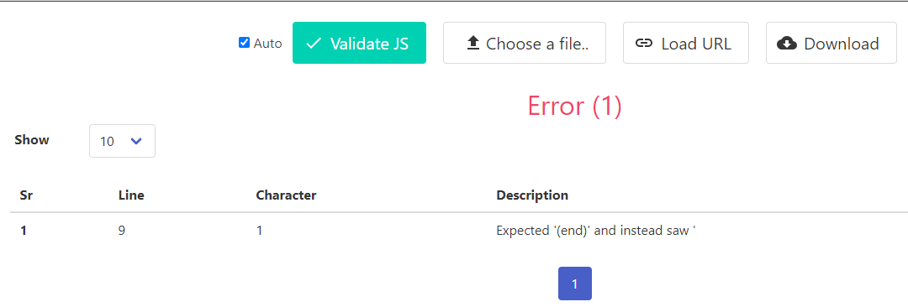

# List of Tests, Validations
- [Lighthouse Reports](Lighthouse Reports)
- [HTML Validator](HTML Validator)
- [CSS Validator](CSS Validator)
- [JS Validator](JS Validator)
- [NavBar, NavLinks, NavButtons](NavBar, NavLinks, NavButtons)
- [Social media links in Footer](Social media links in Footer)

## Lighthouse Reports
-  replace

  validated with Google developer tools

## HTML Validator

-  replace 

  validated with: [W3C Markaup Validation](https://validator.w3.org/)

## CSS Validator

-  replace 

  validated with: [W3C Markup Validation](https://validator.w3.org/)

## JS Validator

-  replace

  validated with: [codebeautify](https://codebeautify.org/jsvalidate)

## NavBar, NavLinks, NavButtons 

| Tested Item | Expected Outcome                                      | Outcome     |
| ----------- | ----------------------------------------------------- | ----------- |
| Home        | Clickable,                                            | as expected |
|             | Opens Home page,                                      | as expected |
|             | Or refreshes it if user is already on Home page,      | as expected |
|             | Color of Home NavLink darkens once it's selected,     | as expected |
|             | Opens in the current tab                              | as expected |         
|             |                                                       |             |
| About       | Clickable,                                            | as expected |
|             | Opens About page,                                     | as expected |
|             | Or refreshes it if user is already on About page,     | as expected |
|             | Color of About NavLink darkens once it's selected,    | as expected |
|             | Opens in the current tab                              | as expected | 
|             |                                                       |             |
| Resources   | Clickable,                                            | as expected |
|             | Opens Resources page,                                 | as expected |
|             | Or refreshes it if user is already on Resources page, | as expected |
|             | Color of Resources NavLink darkens once it's selected,| as expected |
|             | Opens in the current tab                              | as expected | 
|             |                                                       |             |
| Sign In     | Clickable,                                            | as expected |
|             | Visible only when user is not Signed In,              | as expected |
|             | Opens up a Sign In form,                              | as expected |
|             | which shows an option to Sign Up if no account,       | as expected | 
|             | Color of Sign In NavLink darkens once it's selected,  | as expected |
|             | Once logged in, Sign Out replaces Sign In on NavBar,  | as expected |
|             | Message appears "Successfully signed in as (username)"| as expected |
|             | Signed in as (username) appears on the right side,    | as expected |
|             | And is visible on all Pages while user is signed in,  | as expected |
|             | Sign Up option is visible if not signed in            | as expected |
|             |                                                       |             |
| Sign Out    | Sign Out is visible only when user is Signed In,      | as expected |
|             | Color of Sign Out NavLink darkens once it's selected, | as expected |
|             | Opens in the current tab,                             | as expected | 
|             | Sign Out form Opens with an option to Sign Out,       | as expected |
|             | Or refreshes the Sign Out page if user already on Sign| as expected |
|             | Out page,                                             |             |
|             | Sign Out option remains on the page,                  | as expected |
|             | for the user until Sign Out button is clicked,        |             |
|             | after which message pops up: "You have signed out.",  | as expected |
|             | And Sign In option appears instead of Sign Out,       | as expected |
|             | And now on the right side can see "Not signed in",    | as expected |
|             | And Sign Up option is now available in NavBar         | as expected |
|             |                                                       |             |
| Logo        | Clickable,                                            | as expected |
|             | Opens Home page,                                      | as expected |
|             | Or refreshes Home page if user is already on Home page| as expected |
|             | Opens in the current tab                              | as expected | 
|             |                                                       |             |
| NEXT >>     | Visible only on Home page (accessed via               | as expected |
|             | Home page or Logo),                                   |             |
|             | Clickable,                                            | as expected |
|             | Available to user when signed in,                     | as expected |
|             | And when not signed in,                               | as expected |
|             | On the next page << PREV NavButton appears instead    | as expected |
|             |                                                       |             |
| << PREV     | Visible only on Home page after NEXT >> is clicked,   | as expected |
|             | And the user can see the next page,                   |             |
|             | Clickable,                                            | as expected |
|             | Available to user when signed in,                     | as expected |
|             | And when not signed in,                               | as expected |
|             | << PREV is replaced by NEXT >> on the first Home page | as expected |
|             |                                                       |             |
| NavBar Text | Not Clickable,                                        | as expected |
|             | sharing beautiful moments remains the same,           | as expected |
|             | Visible in top right corner on all pages              | as expected |

## Blog Posts, Comments, Edit and Delete Options, Approving of Comments

| Tested Item | Expected Outcome                                      | Outcome         |
| ----------- | ----------------------------------------------------- | --------------  |
| Blog Post   | Clickable,                                            | as expected     |
|             | Opens in a new tab,                                   | as expected     |
|             | Title, author, time of creation are visible,          | as expected     |
|             | Blog Posts text is visible and clear,                 | as expected     |
|             | Image of the blog post is visible beside the title    | not as expected |
|             | screen sizes,                                         |                 |
|             | Image of the blog post is visible on different        | not as expected |
|             | screen sizes,                                         |                 |
|             |                                                       |                 |

| Comment     | Clickable,                                         | as expected     |
|             |                                                       |             |

## Social media links in Footer

| Icon clicked | Expected Outcome                 | Outcome
| ------------ | -------------------------------- | ----------- |
| Facebook     | facebook.com opens in a new tab  | as expected |    
| Twitter/X    | x.com opens in a new tab         | as expected |
| Instagram    | instagram.com opens in a new tab | as expected |
| YouTube      | youtube.com opens in a new tab   | as expected |

## ReadMe links - is it needed?

## Bugs

- Resources app displayed only one resource at a time. With tutor's guidance to add for loop, all of the resources were displayed.

### Images post_detail.html
- Images for bookblog articles showed up as expected on the Home page, matching the subject of the Title.

- When developer clicked on any post, the new page displayed the placeholder image instead of the unique image selected for each post.

- Developer had inspected the page before:

[Previous image](docs/readmeimages/previousinspection.png)

- This time the developer clicked on the image part of the page instead:

[New inspection](docs/readmeimages/newinspection.png)

- The developer finally saw the right area, where image details were
- The developer then compared codes of the images between home page and the new tab:

[Correct code](docs/readmeimages/correctimagecode.png)

[Placeholder code](docs/readmeimages/placeholder.png)

- By matching post_detail.html image code with the home page one, the correct images started to display in the new tab as well:

[Correct image displayed](docs/readmeimages/correctimagedisplayed.png)

### am I Responsive

- am I responsive test showed white screens instead of the website: [Blank am I responsive](docs/readmeimages/amiresponsiveblank.png)
  Thanks to Kera's post on Slack, developer found out that she needed to install [an extension](https://chromewebstore.google.com/detail/ignore-x-frame-headers/gleekbfjekiniecknbkamfmkohkpodhe?pli=1), so that Heroku site could be tested for responsiveness. Sorted! Am I responsive image displayed at the start of the ReadMe.

### Known Bugs

- Resources showing up in Django as Resourcess. The developer understand for future it is important to use singular versions
- Collaboration form to be made smaller to fit on the screen better
- When post is open for further reading, the image of the post is not displaying fully, on developer's screen size
- Resources is missing an image/video on top of the page
- Images/the original links are displayed only as text or link, instead of an image of the page where user will get to 
  after clicking on the link
- js validation showed one error, not fixed
- Spelling check was not done for the website, yet
- Sign up boxes could be shown in a nicer way, at the moment they are not looking even
- Alert messages, pop ups are showing up in the color of the walk-through, instead of developer's chosen color
- Admin and Site Users are not able to crete posts when logged in. Admin can create posts from Django
- Not all of the python files have been checked with [CI Python Linter](https://pep8ci.herokuapp.com/)
- There are errors showing in some of the python files, checked by developer:

- Error pages not added